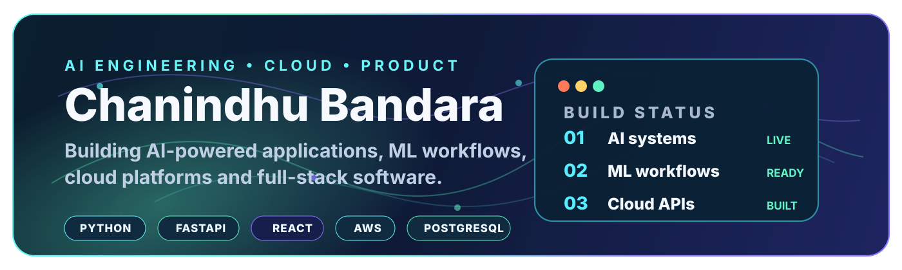
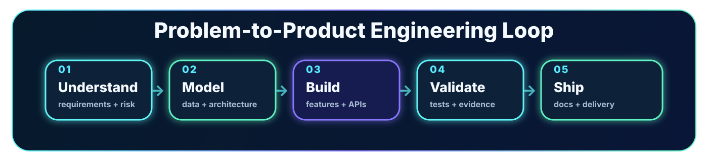

# Hello, I'm Chanindhu Bandara

**Software Engineering Graduate focused on AI Engineering** — building AI-powered applications, machine learning workflows, cloud-backed platforms and full-stack software that can be inspected, improved and delivered professionally.

I like working across the full product path: understanding the problem, shaping the architecture, building the backend and interface, validating behaviour, documenting the system and preparing it for real users.

  
  
  

---

## What I build

- **AI product systems** with practical workflows, role-based interfaces, evidence views and backend services.
- **Machine learning projects** with preprocessing, feature engineering, model comparison, evaluation and prediction outputs.
- **Cloud and backend platforms** using APIs, databases, deployment architecture, monitoring and documentation.
- **Full-stack applications** that connect usable interfaces with reliable data and business logic.
- **Systems and software engineering projects** involving concurrency, distributed components, Java/OOP design and clean project structure.

---

## Flagship project

[EduGuard - Flagship AI Academic Integrity Platform](https://github.com/Chanindhu/eduguard-academic-integrity-platform) is the main project I want reviewers to inspect first. It combines React/TypeScript, FastAPI, PostgreSQL, Celery, RabbitMQ, Redis, plagiarism evidence review, AI-writing risk analysis, role-based dashboards, reporting, tests, screenshots, architecture notes, Postman collections, and performance smoke tests.

Why it leads the portfolio:

- It is the broadest end-to-end product in the portfolio, spanning frontend, backend, data, background jobs, and reviewer-facing workflows.
- It treats AI outputs as review evidence rather than automatic decisions, which shows product judgment as well as implementation.
- It includes proof assets inside the repository so a reviewer can inspect screenshots, setup, architecture, testing, API collections, and performance validation.

## Featured work

| Project | Focus | What it shows |
|---|---|---|
| [EduGuard - Flagship AI Academic Integrity Platform](https://github.com/Chanindhu/eduguard-academic-integrity-platform) | Flagship AI product / full-stack platform | End-to-end academic integrity system with plagiarism evidence review, AI-writing risk analysis, role-based dashboards, reports, feedback, analytics, tests, screenshots, and validation assets. |
| [BLEVE Pressure Prediction ML](https://github.com/Chanindhu/bleve-pressure-prediction-ml) | Machine learning | Feature engineering, preprocessing, CatBoost, XGBoost, SVR, neural networks, model comparison and prediction generation. |
| [PitCrew Connect Cloud Deployment](https://github.com/Chanindhu/pitcrew-connect-cloud-deployment) | AWS cloud platform | EC2, RDS MySQL, VPC, Apache/PHP, CloudWatch, EBS snapshots, load balancing, launch templates and Auto Scaling. |
| [ASP.NET Core Banking Platform](https://github.com/Chanindhu/aspnet-core-banking-platform) | Backend / full-stack | RESTful APIs, MVC web interface, SQLite database, account management, transactions, admin features and layered architecture. |
| [P2P Job Swarm .NET](https://github.com/Chanindhu/p2p-job-swarm-dotnet) | Distributed systems | Peer-to-peer job sharing, ASP.NET Core, WPF, SQLite, SHA-256 verification, Base64 encoding and dashboard monitoring. |
| [C pthread Sorting Simulator](https://github.com/Chanindhu/pthread-sorting-simulator) | Systems programming | POSIX threads, mutexes, condition variables, shared state coordination and C concurrency fundamentals. |

---

## Engineering toolbox

**Languages**  
Python · Java · C# · C · TypeScript · JavaScript · SQL

  
  
  
  
  
  
  

**Backend, APIs and application frameworks**  
FastAPI · Flask · ASP.NET Core · REST APIs · MVC and layered architecture · Authentication workflows

  
  
  
  

**Frontend, mobile and desktop UI**  
React · TypeScript · Tailwind CSS · Android · JavaFX · WPF

  
  
  
  
  

**Data, AI and machine learning**  
Machine learning workflows · Feature engineering · Model evaluation · PostgreSQL · MySQL · SQLite · Jupyter Notebook

  
  
  
  
  

**Cloud, DevOps and engineering tools**  
AWS EC2 · AWS RDS · VPC · CloudWatch · Docker · Git · GitHub Actions · Postman · Linux · Windows

  
  
  
  
  
  
  
  
  

---

## Project archive by area

**AI / ML**  
EduGuard · BLEVE Pressure Prediction ML · AI-assisted academic integrity workflows

**Cloud / backend / full-stack**  
PitCrew Connect · ASP.NET Core Banking Platform · Flask Web Security Lab

**Distributed and systems engineering**  
P2P Job Swarm .NET · MKX Gaming Lobby WCF · C pthread Sorting Simulator · Air Traffic Simulator Java

**Java / OOP / algorithms**  
JavaFX Maze Game Engine · Railway Network Simulator Java · City Grid Planner Java · Airline Route Planner DSA · Numerology Analyzer Java

**Mobile and UX**  
Calorie Tracker Android · Connect Four Android · OnlyFit UX Case Study

---

## How I work

- **Understand before building** — clarify the real requirement, constraints, users and failure paths.
- **Design readable boundaries** — keep APIs, data models, domain logic, integrations and UI responsibilities understandable.
- **Build for evidence** — use tests, validation, screenshots, reports, documentation and reproducible setup steps.
- **Treat security as engineering** — validate inputs, protect sensitive configuration and avoid exposing secrets.
- **Finish professionally** — a project is not done until another person can inspect, run, understand and maintain it.

---

## Academic foundation

**Bachelor of Computing — Software Engineering Major**  
Curtin University, Colombo

- Completed degree requirements; graduation ceremony pending.
- Course Weighted Average: **78.71**
- Dean's List: **Year 2 Semester 2** and **Year 3 Semester 2**
- Strong results across cloud computing, machine learning, capstone project work, operating systems, distributed systems, mobile application development and software architecture.

**Google AI Essentials**  
Coursera / Google Career Certificates — practical AI productivity, prompting, responsible AI use and modern AI workflows.

---

## Currently focused on

- Turning academic and personal projects into clean public engineering case studies.
- Strengthening AI engineering skills through Python, ML workflows, backend APIs and production-style project delivery.
- Building a portfolio that shows practical software range without losing focus on AI-powered systems.

---

  <strong>Build useful systems. Validate the behaviour. Document the truth. Ship work that another engineer can trust.</strong>

